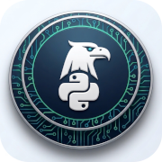

# omni.ai



A Python desktop application (GUI) for interacting with the PCSS LLM Service, built with **PySide6 (Qt)** and **LangChain**.

> Actively developed on macOS; Windows and Linux supported. See [CHANGELOG.md](CHANGELOG.md) for recent feature updates.

## ✨ Key Features

### 1. 💬 Chat Mode
-   **Conversation History**: All chats are saved locally to an SQLite database (`conversations.db`).
-   **Model Selection**: Dynamically fetches models from PCSS (e.g., `bielik_11b`, `DeepSeek-V3.1-vLLM`).
-   **Import/Export**: Save and load specific conversations to JSON files.
-   **Markdown Support**: Full rendering of headings, code blocks, and lists.

### 2. 🤖 Agent Mode (Autonomous)
The application features a powerful Agent capable of performing complex, multi-step tasks.

**File Management**
-   `list_directory`, `write_file`, `create_directory`, `copy_file`, `move_file`, `file_delete`, `file_search`
-   `view_file` — read file content with **1-indexed line numbers** (auto-truncates to protect context limits).
-   `replace_file_content` — **precision line-based editing**: surgically targets specific code blocks via start/end line integers instead of brittle string matching.
-   `search_files` — cross-file pattern/string search across the workspace
-   `count_pattern_in_file` — count regex occurrences inside large logs efficiently

**Code & Data Execution**
-   `run_terminal` — sandboxed shell execution (e.g., `python app.py`) with strict workspace constraints and robust timeout / SIGKILL logic.
-   `run_python` — execute Python code snippets for calculations, data processing, and logic testing

**Internet & Research**
-   `search_web` — DuckDuckGo general search
-   `search_news` — DuckDuckGo latest news
-   `search_academic` — search PubMed/ArXiv/Semantic Scholar for academic papers
-   `visit_page` — fetch and extract full article text from a URL (up to 15,000 chars)
-   `deep_research` — **automated research pipeline**: runs multiple searches, visits top sources, summarizes each with AI, and returns a structured report

**Browser Automation (MCP)**
-   `playwright_*` — 33+ tools for headless browser control (navigate, click, type, screenshot) using **Model Context Protocol**

**Document Processing**
-   `read_pdf`, `read_docx`, `read_xlsx`, `save_document`,-   `convert_document` — read and generate files
-   `ocr_image` — extract text from images/scans (Nanonets OCR)
-   `generate_chart` — generate charts and visualizations from data

### 3. 🎙️ Audio Transcription & Dictation
-   **Configurable Transcription**: Choose your preferred Whisper model (e.g., `whisper-large-v3-turbo:0.8b`) in Settings to use with the `transcribe_audio` tool.
-   **System-wide Dictation App**: A standalone utility (`voice_typing.py`) that runs in the tray and allows you to dictate text into **any** application via a global hotkey (`Left Ctrl + Space`).
-   **Secure Keys**: Both apps share a secure connection to PCSS via the system Keyring.

### 4. 💬 Chat vs. 🤖 Agent (Important!)

The application offers two distinct ways to interact with AI models. Understanding the difference is key to getting the best results.

| Feature | **Chat Tab** | **Agent Mode Tab** |
| :--- | :--- | :--- |
| **Primary Use** | Fast, conversational Q&A | **Executing Tasks**, Research, Coding, Automation |
| **Autonomy** | Replay-based (standard chat) | **Autonomous** (reasoning loops) |
| **Tool Usage** | ❌ No Tools access | ✅ **Full Toolbox** (Files, Web, Python, OCR) |
| **Internet Access** | ❌ Offline (model knowledge only) | ✅ **Live Web Search** (DuckDuckGo, Deep Research) |
| **File Access** | ❌ No file system access | ✅ Read, Write, Edit, Search workspace files |
| **Python Sandbox** | ❌ None | ✅ Execute Python for logic/calcs |
| **Browser** | ❌ None | ✅ Full Playwright browser automation (MCP) |

> [!IMPORTANT]
> If you need the model to **search the web**, **read your local files**, **analyze graphics**, or **run code**, you MUST use the **Agent Mode** tab. The standard Chat mode does not have access to these tools.

### 5. 🏠 Architecture & Persistence
The application is designed for full data continuity and flexible session management:
- **Full Session Persistence**: All interactions (Chat and Agent modes) are saved in a local SQLite database (`conversations.db`). Sessions are fully restored upon restart.
- **Memory Management**:
    - **Short-term (Thread) Memory**: The agent maintains context within a specific thread. Use the **"New Thread"** button to start a fresh session while keeping the historical log.
    - **Few-Shot Learning (Long-term)**: When an assistant is initialized, the system fetches your **top-rated interactions** (Thumbs Up) from the database and uses them as few-shot examples. This allows the agent to "learn" your preferences and preferred tool usage patterns over time.
- **Thread Control**: Users can freely switch between historical threads. Individual conversations can be deleted via the **Right-Click Context Menu** in the history list, or the entire history can be purged using the **"Clear History"** button.

### 6. 🔒 Security
-   **Secure Storage**: API Keys are stored in the system Keyring (macOS Keychain, Windows Credential Locker), never in plain text.
-   **Local Data**: All history and settings are stored locally.
-   **Documentation**: See [MODEL_GUIDE.md](MODEL_GUIDE.md) and [TOOLS_GUIDE.md](TOOLS_GUIDE.md).

### 7. 🏋️ Benchmarking Suite

The repository includes a comprehensive, modular benchmark suite designed to evaluate the PCSS model's chat fluency and autonomous capabilities. The agent benchmarks extract the exact tool schema dynamically from the application (e.g. `omni_agent.core.tools`), ensuring test accuracy.

**Available Commands (run from root directory):**
- **List Models**: `python -m omni_agent.benchmarks.run_chat --list-models`
  - *(Dynamically fetches the current list of available PCSS models without running benchmarks).*
- **Chat Benchmark**: `python -m omni_agent.benchmarks.run_chat --models bielik_11b,Qwen3.5-397B-A17B-GPTQ-Int4`
- **Agent Benchmark (Mock)**: `python -m omni_agent.benchmarks.run_agent --models bielik_11b --mode mock`
  - *(Evaluates schema understanding using fast OpenAI native function-calling).*
- **Agent Benchmark (Real)**: `python -m omni_agent.benchmarks.run_agent --models bielik_11b --mode real`
  - *(Spawns the real `LangChainAgentEngine` inside an isolated temporary proxy directory to verify format syntax and sequential thought cycles).*

**Viewing Results:**
Every benchmark execution generates an aggregated markdown summary located in the root file: **[`BENCHMARK_RESULTS.md`](BENCHMARK_RESULTS.md)**.
Detailed descriptions of each test case can be found in **[`BENCHMARK_TASKS.md`](BENCHMARK_TASKS.md)**.
Detailed historic log dumps (.md format) for each specific trace are safely archived in `omni_agent/benchmarks/results/`.

## 🛠️ Installation

### Prerequisites
-   **Anaconda** or **Miniconda** installed.
-   Python **3.11+** (Conda environment pins 3.11; some optional deps require modern typing)
-   **Node.js / npm** — required for the Playwright MCP server (`npx`).
-   **Pandoc** >= 3.0 ([Download](https://github.com/jgm/pandoc/releases)) — required for document conversion.

### Setup (Conda - Recommended for macOS/Linux)

1.  **Clone the Repository**
    ```bash
    git clone https://github.com/moondec/omni.ai.git
    cd Bielik
    ```

2.  **Create the Conda Environment**
    ```bash
    conda env create -f environment.yml
    conda activate bielik
    ```

    *Or manually (includes all new dependencies):*
    ```bash
    conda create -n bielik python=3.11 -y
    conda activate bielik
    conda install -c conda-forge pyside6 openai keyring markdown \
        langchain langchain-openai langchain-community \
        pypdf python-docx openpyxl pypandoc weasyprint \
        duckduckgo-search requests beautifulsoup4 \
        matplotlib-base pyyaml pandas numpy pygments pydantic -y
    pip install readability-lxml mcp langchain-mcp-adapters pdfplumber
    ```

    > [!NOTE]
    *   `readability-lxml` is a `pip`-only package and is **required** for the `visit_page` and `deep_research` tools to extract article content from web pages. It is already included in `environment.yml`.

### Setup Alternative (venv + pip)

Recommended if you prefer not to use Conda or encounter installation issues.

1.  **Clone the Repository**
    ```bash
    git clone https://github.com/moondec/omni.ai.git
    cd Bielik
    ```

2.  **Create and activate the virtual environment**

    **macOS / Linux:**
    ```bash
    python3 -m venv venv
    source venv/bin/activate
    ```

    **Windows:**
    ```cmd
    python -m venv venv
    venv\Scripts\activate
    ```

3.  **Install requirements**
    ```bash
    pip install --upgrade pip
    pip install -r requirements.txt
    ```

    > [!TIP]
    > **Dictation App Dependencies**: Running the dictation utility for the first time will ensure `pynput`, `sounddevice`, and `soundfile` are available. Check `requirements.txt` for details.

4.  **🧠 Smart Document Intelligence (Optional)**

    The application includes advanced tools for visual and layout-aware document analysis powered by **Docling** (IBM, MIT license). These tools run **100% locally** — no data leaves your machine.

    > These tools parse PDF and DOCX "like a human" — understanding complex layouts, extracting tables/images, and performing high-fidelity translations.

    To activate, you must install the additional dependencies manually:
    ```bash
    pip install docling pillow
    ```

    > ⚠️ **Note:** Docling requires PyTorch (~1 GB additional disk space).

    Once installed, you will see this confirmation in the agent logs at startup:
    ```
    ✓ Smart Document Tools (Docling) loaded
    ```

    **New tools available after installation:**

    | Tool | Description |
    | :--- | :--- |
    | `smart_read_document` | Read PDF/DOCX with AI layout analysis, image extraction, and optional Vision interpretation |
    | `translate_document` | Translate documents while preserving original formatting, styles, and embedded images |
    | `extract_document_images` | Extract all images/graphics from a document as standalone PNG files |

    Without Docling, the application continues to function normally using standard `read_pdf` and `read_docx` tools.

## ⚙️ Configuration

1.  **API Key**: On first launch, enter your PCSS Cloud API Token. This is stored securely in your system's Keyring.
2.  **Settings Dialog**: Click the **Settings** icon in the UI to manage your configuration:
    - **Workspace**: Select the directory where the Agent is allowed to operate.
    - **Default Model**: Choose your preferred model for Chat and Agent modes.
    - **LLM Server URL (`base_url`)**: The application supports connecting to **any OpenAI-compatible API server**. You can change the URL directly in this dialog.

3.  **Manual Edit (`settings.json`)**: Alternatively, you can edit the configuration file manually:

    ```json
    {
        "workspace_path": "/path/to/workspace",
        "model": "your-model-name",
        "theme": "Cobalt",
        "base_url": "https://llm.hpc.pcss.pl/v1"
    }
    ```

    **Examples for popular local servers:**

    | Server | `base_url` value |
    | :--- | :--- |
    | **PCSS HPC** (default) | `https://llm.hpc.pcss.pl/v1` |
    | **LM Studio** | `http://127.0.0.1:1234/v1` |
    | **Ollama** | `http://127.0.0.1:11434/v1` |
    | **vLLM** (local) | `http://127.0.0.1:8000/v1` |
    | **OpenAI** | `https://api.openai.com/v1` |
    | **openrouter** | `https://openrouter.ai/api/v1` |

    > [!NOTE]
    > Changing the `base_url` affects **all components**: Chat, Agent, multi-agent Consilium, OCR, and Vision tools.

## ▶️ Usage

### 1. Activate Environment
- **Conda**: `conda activate bielik`
- **venv (macOS/Linux)**: `source venv/bin/activate`
- **venv (Windows)**: `venv\Scripts\activate`

```bash
python omni_agent/main.py
```

### 3. Run Dictation Utility (Standalone)
To use the global "Voice-to-Text" feature in any application (Terminal, VSCode, etc.):
```bash
python voice_typing.py
```
- **Hotkey**: Hold `Left Ctrl + Space` to record. Release to transcribe and type.
- **Permissions**: On macOS, you must grant "Accessibility" permissions to the Terminal/Python in System Settings.

## ⚠️ Conda update

# Switch to base environment

conda activate base

# Update conda to the latest version

conda update -n base conda

## 🔄 Updating the Environment

When dependencies are added or updated (e.g., changes to `requirements.txt` or `environment.yml`), follow these steps:

1. **Pull latest changes**
   ```bash
   git pull
   ```

2. **Update dependencies**
   - **If using Conda**:
     ```bash
     conda env update --file environment.yml --prune
     ```
   - **If using venv**:
     ```bash
     pip install -r requirements.txt
     ```

### Tips
-   **Chat**: `Shift+Enter` for new lines, `Enter` to send.
-   **Agent**: Go to **Agent Mode** → **Create Assistant** to initialize the engine. Then type requests like:
    -   *"Perform deep research on AI in Poland and save the report to report.md"*
    -   *"Read report.pdf and create a summary summary.txt"*
    -   *"Write a Python script and run it to check the data"*

## 🔍 Troubleshooting

### 1. `ModuleNotFoundError: No module named 'PySide6'`
If after activating the environment (`conda activate` or `venv\Scripts\activate`) you still get a module not found error, it might be due to a conflict between multiple Python installations (e.g., Anaconda + Homebrew).
- **Symptom**: `pip list` shows PySide6, but `python main.py` throws an error.
- **Solution**: Check which Python executable is being used:
  ```bash
  which python
  python --version
  ```
  If the path points to a global installation instead of your `venv/bin/` or Conda `envs/` folder, you need to fix the symlinks in the environment (`ln -sf`) or use the full path to the interpreter.

### 2. DLL and SSL Issues on Windows (Conda + PySide6)
Conda environments on Windows do not always reliably load Qt libraries (DLLs). Additionally, Conda often "leaks" SSL environment variables into other virtual environments.
- **Solution**: The application includes a built-in mechanism in `main.py` that:
  - Automatically adds Conda/PySide6 DLL paths to `os.add_dll_directory`.
  - Clears incorrect `SSL_CERT_FILE` and `CURL_CA_BUNDLE` paths that might prevent connection to LLM models.

### 3. Playwright Issues (Agent Mode)
Browser tools require Node.js and installed drivers. If the Agent reports a Playwright error, run manually:
```bash
npx playwright install chromium
```

## 🏗️ Technology Stack

| Layer | Technology |
| :--- | :--- |
| **GUI** | PySide6 (Qt6) |
| **LLM Engine** | LangChain + LangGraph |
| **API** | OpenAI Compatible (PCSS HPC) |
| **Database** | SQLite |
| **Web Search** | DuckDuckGo (`ddgs`) |
| **Browser Auto (MCP)** | `mcp`, `playwright-mcp-server` via `npx` |
| **Web Scraping** | `requests`, `beautifulsoup4`, `readability-lxml` |
| **Documents** | `pypdf`, `python-docx`, `pypandoc`, `weasyprint` |
| **Visualization** | `matplotlib` |
